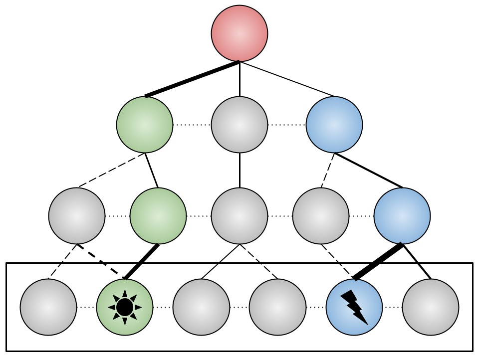

# LCZero Planning Interpretability

Scripts for interpreting planning in LeelaChessZero networks.

## Structure

Structure of the repo.

## Tooling

See the [lczerolens] (still under development) library for more agnostic tooling to interpret the Leela Networks.

## Cite

If you find this work useful consider citing the associated paper:

```
Bibtex
```
